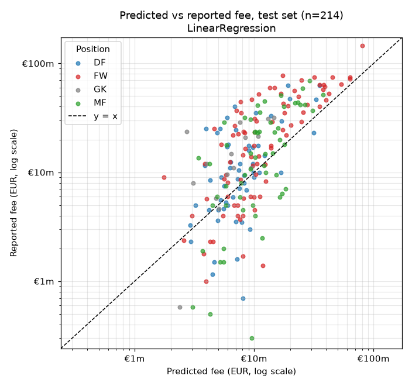
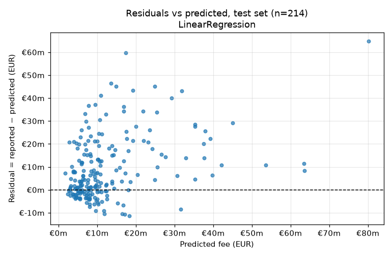
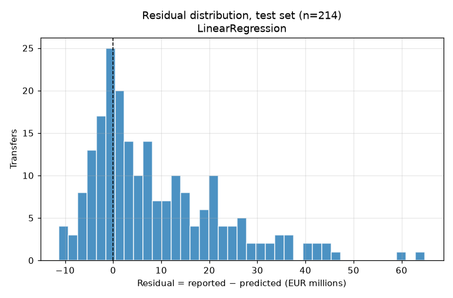

# Transfer Value Predictor

**A methodology study of PL-active players' reported transfer fees.**

> Among players with recent Premier League minutes, how much of their **reported** transfer fee can recent PL performance, age, and position explain on a later time holdout, and where does a linear model fail?

Short answer: a plain linear model on `log1p(fee)` beats every naive baseline by about €4m of mean absolute error, and the bootstrap interval excludes zero. It is still wrong by €11m on an average transfer, it under-predicts 70% of test transfers, and it misses elite and Saudi-bound forwards by €45m to €65m. Jump to the [five worst misses](#five-worst-misses).

## What this is, and what it is not

- **Is:** a leakage-controlled, time-split study of paid permanent transfers of players with enough recent PL minutes, **regardless of destination club**. One row per transfer.
- **Is:** a failure analysis. The interesting output is where and why the model misses.
- **Is not:** a player valuation tool, a price recommendation, or betting advice.
- **Is not:** "all transfers into the Premier League". Newcomers without qualifying PL minutes are outside the cohort.
- **Label:** the reported fee from Transfermarkt, not Transfermarkt's market value. Market value is never a model input.

## Results

All six methods are scored on the same test transfers. Baselines are fit on training labels only. The model marked in bold was chosen by chronological cross-validation inside the training window **before** the test set was scored.

<!-- BEGIN:results -->
| Method | Selected by CV | Test MAE | Median AE | RMSE | Test log-MAE | Test rows |
| --- | --- | ---: | ---: | ---: | ---: | ---: |
| Train median fee |  | €15.25m | €9.20m | €23.06m | 0.929 | 214 |
| Train mean fee |  | €15.47m | €12.25m | €21.21m | 0.940 | 214 |
| Train median fee by position |  | €15.21m | €8.80m | €22.79m | 0.935 | 214 |
| **LinearRegression** | yes | €11.20m | €6.54m | €16.44m | 0.719 | 214 |
| Ridge |  | €11.20m | €6.53m | €16.43m | 0.719 | 214 |
| ElasticNet |  | €11.59m | €6.78m | €17.00m | 0.723 | 214 |

Split: train `transfer_date < 2024-05-20` (480 transfers, cycles 2014–2023); test `>= 2024-05-20` (214 transfers, 203 players, 2024-07-01 to 2026-02-07, cycles 2024, 2025). Predictions clamped at zero: 0.
<!-- END:results -->

Paired bootstrap on the difference in test MAE between the selected model and each baseline:

<!-- BEGIN:bootstrap -->
| Baseline | ΔMAE (model − baseline) | 95% CI | Reading |
| --- | ---: | --- | --- |
| Train mean fee | −€4.27m | −€5.76m to −€2.78m | model MAE lower; interval excludes zero |
| Train median fee | −€4.05m | −€5.52m to −€2.75m | model MAE lower; interval excludes zero |
| Train median fee by position | −€4.02m | −€5.40m to −€2.74m | model MAE lower; interval excludes zero |

5,000 paired replicates, seed 42, resampling unit: player (203 unique test players; 11 with more than one test transfer). Negative favors the model. The interval covers holdout sampling noise only; it does not include retraining or future drift.
<!-- END:bootstrap -->

Cross-validation inside the training window (selection objective: mean fold MAE on `log1p(fee)`):

<!-- BEGIN:cv -->
| Family | Best params | CV log-MAE | Fold SD | Per fold | Selected |
| --- | --- | ---: | ---: | --- | --- |
| LinearRegression | none | 0.8097 | 0.0580 | 0.757 / 0.782 / 0.890 | yes |
| Ridge | alpha=0.1 | 0.8097 | 0.0580 | 0.757 / 0.782 / 0.890 |  |
| ElasticNet | alpha=0.1, l1_ratio=0.15 | 0.8240 | 0.0575 | 0.795 / 0.773 / 0.904 |  |

Folds: cycle 2021 (276 train / 49 validation), cycle 2022 (325 train / 70 validation), cycle 2023 (395 train / 85 validation). Tie-break: mean_log_mae rounded to 4 dp; std_log_mae rounded to 4 dp; grid order.
<!-- END:cv -->

Model selection used log-MAE; the headline is euro MAE on the holdout. These are different objectives, and minimizing one does not minimize the other.

## Plots



Log-log axes so the full range, including the €145m outlier, is visible. Points above the dashed `y = x` line are under-predictions. Most of the cloud sits above the line, and the vertical spread at any predicted value is wide: a €10m prediction covers reported fees from under €1m to over €40m.



Residual = reported − predicted, in euros. Positive means the model under-predicted. Errors fan out as predictions grow, which is what a log-scale model looks like in euro space.



The distribution is centered above zero with a long right tail. The model's misses are not symmetric noise.

### What the errors look like

<!-- BEGIN:diagnostics -->
- 70% of test transfers were under-predicted. Mean residual €9.1m, median €4.6m; mean log residual +0.289 (predictions about 1.33× too low on the log scale).
- Mean in-sample log residual of the selected model by training cycle: 2014: -0.74, 2015: -0.34, 2016: -0.21, 2017: -0.07, 2018: +0.09, 2019: +0.21, 2020: +0.07, 2021: -0.07, 2022: +0.07, 2023: +0.28. Test cycles: 2024: +0.29, 2025: +0.29.
- Median reported fee by cycle: 2014: €6.0m, 2015: €8.0m, 2016: €11.0m, 2017: €11.0m, 2018: €10.0m, 2019: €16.5m, 2020: €16.2m, 2021: €11.1m, 2022: €12.0m, 2023: €18.5m, 2024: €12.0m, 2025: €15.0m.

| Position | Test rows | MAE | Median residual |
| --- | ---: | ---: | ---: |
| DF | 57 | €8.10m | €1.87m |
| FW | 85 | €13.95m | €7.25m |
| GK | 15 | €8.97m | €7.88m |
| MF | 57 | €10.77m | €3.62m |
<!-- END:diagnostics -->

Two patterns stand out, both computed after model selection and not fed back into the model:

1. **Time drift.** In-sample residuals climb from strongly negative in the 2014 cycle to positive by 2023. Fees are nominal euros and the model has no time term, so it effectively predicts an average-era fee and lands low on the latest cycles. A pre-registered time trend or fee deflator is the obvious next experiment. Adding one now, after seeing the test set, would be tuning on the holdout, so it is not done here.
2. **Retransformation.** `expm1` of a log-scale prediction estimates something closer to a conditional median than a mean. That pulls euro predictions down for a right-skewed target. No smearing correction is applied.

## Five worst misses

The five largest absolute euro errors of the selected model, ranked deterministically (ties broken by transfer ID). All five are forwards, and all five are under-predictions.

<!-- BEGIN:misses -->
| # | Player | Move | Date | Reported | Predicted | Residual | Age | Pos | Lookback |
| ---: | --- | --- | --- | ---: | ---: | ---: | ---: | --- | --- |
| 1 | Alexander Isak | Newcastle → Liverpool | 2025-09-01 | €145.0m | €80.1m | +€64.9m | 25 | FW | 5040 min, 44 G, 8 A (2023,2024) |
| 2 | Jhon Durán | Aston Villa → Al-Nassr | 2025-01-31 | €77.0m | €17.3m | +€59.7m | 21 | FW | 1214 min, 12 G, 0 A (2022,2023,2024) |
| 3 | Moussa Diaby | Aston Villa → Al-Ittihad | 2024-07-24 | €60.0m | €13.6m | +€46.4m | 25 | FW | 2186 min, 6 G, 8 A (2023) |
| 4 | Luis Díaz | Liverpool → Bayern Munich | 2025-07-30 | €70.0m | €24.8m | +€45.2m | 28 | FW | 5059 min, 21 G, 12 A (2023,2024) |
| 5 | Pedro Neto | Wolves → Chelsea | 2024-08-11 | €60.0m | €14.8m | +€45.2m | 24 | FW | 2489 min, 2 G, 10 A (2022,2023) |
<!-- END:misses -->

**1. Alexander Isak, Newcastle to Liverpool (2025-09-01).** This is the model's highest prediction in the test set, so it ranks him correctly. It still sits €65m short. His lookback is excellent (0.79 goals per 90 over two full seasons), but an additive log-linear model has no way to reach a record fee. *Hypotheses, not observed in the data:* scarcity of elite strikers, competitive bidding, contract situation.

**2. Jhon Durán, Aston Villa to Al-Nassr (2025-01-31).** 55 appearances but only 1,214 minutes, so most of them were off the bench. Minutes is the model's largest coefficient, so a high per-90 rate on few minutes still produces a low prediction. *Hypotheses:* buying-club wealth (a Saudi Pro League destination), age 21 with perceived upside.

**3. Moussa Diaby, Aston Villa to Al-Ittihad (2024-07-24).** Only one PL season in the lookback because he arrived from the Bundesliga in 2023. The feature set is PL-only by design, so his earlier record is invisible. *Hypotheses:* buying-club wealth, non-PL track record, the price Villa had paid a year earlier.

**4. Luis Díaz, Liverpool to Bayern Munich (2025-07-30).** Two full seasons (5,059 minutes, 21 goals, 12 assists) but age 28. Age carries a strong negative coefficient. *Hypotheses:* elite-to-elite moves price in things the model cannot see, such as international profile and a short list of comparable wingers.

**5. Pedro Neto, Wolves to Chelsea (2024-08-11).** 2,489 minutes across two seasons (injury-limited) with 2 goals and 10 assists. Low minutes and low goals both push the prediction down. *Hypotheses:* chance creation that goals and assists undercount, and buyers discounting injury-shortened seasons.

Common thread: three of five had limited PL minutes in the lookback, two went to Saudi clubs, and the one elite striker with a full record was still compressed toward the middle. Residuals alone cannot say which factor dominated in any case.

## Method

- **Cohort.** Paid permanent transfers (`fee > 0`) whose player has at least 90 Premier League minutes in the lookback window. Destination is unrestricted.
- **Row grain.** One row per transfer. A player can appear more than once, but a transfer never appears in both train and test.
- **Lookback (as-of rule).** For a transfer recorded on date `D`: league appearances with `match_date < D` from the **two latest source PL seasons completed before `D`**, plus the pre-`D` matches of a season still in progress at `D`. A season is complete only when all 380 games are present and played, and its completion date is its last match. No July-to-June buckets. A July transfer usually has no season in progress. The extended 2019/20 season (last match 2020-07-26) counts as in progress for a mid-July 2020 transfer and as completed in August.
- **Features.** Goals, assists, minutes, appearances, goals per 90, assists per 90, age at `D` (floor years from date of birth), and position. Per-90 values require at least 90 minutes, and rows below that are dropped, never zero-filled.
- **Position.** The most frequent lineup position across the same lookback appearances, mapped to GK/DF/MF/FW (fixed tie-break order). If a player has no lineup rows, the current profile position is used as a **retrospective proxy**, flagged per row. Proxy rows are exempt from the strict as-of claim.
- **Target.** `log1p(fee_eur)`. Euro predictions are `max(expm1(prediction), 0)`.
- **Models.** LinearRegression, Ridge (`alpha` 0.1, 1, 10, 100), and ElasticNet (`alpha` 0.1, 1, 10 × `l1_ratio` 0.15, 0.5, 0.85). All share one scikit-learn `Pipeline`: `StandardScaler` on numeric inputs, `OneHotEncoder(handle_unknown="ignore")` on position, and an explicit input allowlist.
- **Transfer cycles.** Cycle *s* runs from the day after season *s−1*'s last match to the day after season *s*'s last match, which keeps each summer window in one piece. The study window is cycles 2014 to 2025 (2014 is the first cycle with two completed seasons of lookback in the source).
- **Split.** `T = 2024-05-20`, the start of the 2024 cycle (the day after the 2023/24 season ended). Train: `transfer_date < T`. Test: `transfer_date >= T`, which covers the last two cycles.
- **Selection.** Expanding chronological folds: each of the last three training cycles is validated by a model trained on all earlier cycles. Preprocessing is refit inside every fold. The best candidate per family is refit on the whole training window, and the overall CV winner is fixed before the holdout is opened. CV differences below 1e-4 log-MAE count as ties and fall back to the fixed grid order (Ridge with `alpha=0.1` and OLS differed by 6e-8).
- **Uncertainty.** A paired bootstrap resamples unique test players with replacement and keeps all of each player's transfers, including repeats when a player is drawn twice. It uses 5,000 replicates, seed 42, and the same draws for the model and every baseline.

## Leakage checklist

- [x] Every contributing appearance satisfies `match_date < transfer_date`, and same-day matches are excluded. See [`tests/test_leakage.py`](tests/test_leakage.py).
- [x] Source season metadata defines the two completed seasons and any in-progress prefix. See [`tests/test_features.py`](tests/test_features.py) for the summer gap and the extended 2019/20 season.
- [x] The current-position fallback is flagged and reported with total, train, and test percentages (funnel section below).
- [x] No destination-club, fee-derived, or market-value inputs. The pipeline rejects forbidden columns: [`features.assert_allowed_inputs`](src/transfer_value/features.py).
- [x] Joins use IDs only, and no transfer ID appears in both train and test. See [`tests/test_split.py`](tests/test_split.py).
- [x] Scalers and encoders are fit inside each fold's training rows, through one `Pipeline`.
- [x] Baselines use training labels only, including the position-median fallback. See [`tests/test_evaluate.py`](tests/test_evaluate.py).
- [x] Selection uses only the training window. Headline numbers use `transfer_date >= T`.

Worked example, mirrored in `tests/test_leakage.py` with a fixture player:

| Field | Allowed construction | Rejected construction |
|---|---|---|
| Player, recorded transfer date | Alex Example, 2023-07-15 | Same player and date |
| Completed-season lookback | PL matches in 2021/22 and 2022/23 | A July-to-June bucket described as a completed season |
| Transfer-day and later appearances | Excluded | Goals on 2023-07-15 or in August 2023 enter the aggregates |
| Market value dated 2023-08-01 | Not a model input | Used to predict the July fee |
| Current profile position | Allowed only with a proxy flag | Described as known before the deal without evidence |

The test adds a same-day and a later appearance with goals and asserts that every performance feature is unchanged. A separate test asserts that market value cannot be passed into the pipeline.

## Coefficients in plain English

Selected model (LinearRegression), fit on the training window:

<!-- BEGIN:coefficients -->
| Term | Kind | Coefficient (log1p fee) | exp(coef) | 1 training SD = |
| --- | --- | ---: | ---: | ---: |
| `goals` | num | +0.125 | ×1.134 | 7.15 |
| `assists` | num | +0.050 | ×1.051 | 4.24 |
| `minutes` | num | +0.771 | ×2.162 | 1,893 |
| `appearances` | num | -0.330 | ×0.719 | 22 |
| `goals_per90` | num | +0.130 | ×1.139 | 0.166 |
| `assists_per90` | num | +0.062 | ×1.064 | 0.133 |
| `age` | num | -0.442 | ×0.643 | 3.32 |
| `position_DF` | cat | -0.079 | ×0.924 |  |
| `position_FW` | cat | +0.077 | ×1.080 |  |
| `position_GK` | cat | -0.106 | ×0.900 |  |
| `position_MF` | cat | +0.108 | ×1.114 |  |
| `(intercept)` | intercept | +16.122 |  |  |
<!-- END:coefficients -->

How to read this:

- Numeric inputs are standardized. A coefficient is the change in predicted `log1p(fee)` for a **one training-SD increase** in that input, holding the other inputs fixed. `exp(coef)` multiplies `1 + fee`; it is not a euro amount.
- **Minutes** dominate: one SD more minutes (about 1,900) roughly doubles the prediction. Being a regular starter is the strongest signal this feature set has.
- **Appearances** are negative *given minutes*: more appearances for the same minutes means more substitute outings. Minutes and appearances are strongly correlated, so neither sign should be read alone.
- **Age** is strongly negative: one SD older (about 3.3 years) cuts the prediction by roughly a third, consistent with buyers paying for resale value (a hypothesis).
- **Goals** and **goals per 90** both help and overlap heavily. **Assists** add little once goals and minutes are known.
- **Position** uses full one-hot encoding with an intercept, so a single position coefficient is not identifiable on its own. Only differences between positions mean anything: midfielders and forwards come out above defenders, and goalkeepers lowest.
- None of this is causal. The inputs are collinear and the coefficients describe this fitted model, not the transfer market.

## Data provenance and filters

Data: [Transfermarkt](https://www.transfermarkt.com/) via the community [transfermarkt-datasets](https://github.com/dcaribou/transfermarkt-datasets) by David Cariboo ([Kaggle mirror](https://www.kaggle.com/datasets/davidcariboo/player-scores)). All rights remain with Transfermarkt and the dataset maintainers. Raw files are not committed. [`data/raw/SOURCE.md`](data/raw/SOURCE.md) pins the URL, byte size, and SHA-256 of every file. The upstream collection paused in July 2026, so this snapshot is effectively frozen.

How fees and loans are encoded: the source has no transfer-type or loan column. Upstream parses the Transfermarkt fee string so that `-`, `?`, and blank become null, `free transfer` becomes 0, strings starting with `€` are parsed, and **every other string becomes 0**. That last group covers "loan transfer", "End of loan", and "Loan fee: €X". So a positive fee is a paid permanent move, while free transfers, loans (paid or not), and loan returns all share a fee of 0 and are excluded together. Spot checks against known paid loans (Lukaku to Inter 2022, Cancelo to Bayern 2023, Sancho to Chelsea 2024) all show 0.

Sequential funnel (each dropped row has exactly one first-failure reason):

<!-- BEGIN:funnel -->
| Step | Rows | Dropped | Reason / note |
| --- | ---: | ---: | --- |
| raw transfer rows after exact dedup | 175,165 |  |  |
| valid player ids | 175,165 | 0 | missing_player_id |
| valid transfer dates | 175,165 | 0 | missing_transfer_date |
| in study window | 150,219 | 24,946 | outside_study_window |
| fee field present | 100,322 | 49,897 | undisclosed_fee |
| fee well formed | 100,322 | 0 | malformed_fee |
| positive reported fee | 16,106 | 84,216 | zero_fee_free_or_loan |
| classified permanent | 16,106 | 0 | Implied by a positive fee under the source encoding (loans are recorded as 0). |
| classified non loan | 16,106 | 0 | Implied by a positive fee under the source encoding (loans are recorded as 0). |
| unique transfer identity | 16,106 | 0 | Natural key unique; conflicts fail ingest. |
| lookback coverage available | 16,106 | 0 | no_lookback_coverage |
| league active candidates | 760 | 15,346 | no_league_appearances_in_lookback |
| sufficient lookback minutes | 694 | 66 | insufficient_lookback_minutes |
| valid per90 features | 694 | 0 | invalid_per90 |
| usable age | 694 | 0 | missing_age |
| usable position | 694 | 0 | missing_position |
| final supervised rows | 694 |  |  |

Position source in the final cohort: current_proxy 5, historical_appearance 689 (0.72% proxy overall; train 1.04%, test 0.0%). Rows per cycle: 2014: 25, 2015: 33, 2016: 43, 2017: 54, 2018: 35, 2019: 55, 2020: 31, 2021: 49, 2022: 70, 2023: 85, 2024: 97, 2025: 117. Possible loans or buy-backs (a paid move followed within 400 days by a zero/unknown-fee move back to the seller): 4 of 694 final rows (1 in test); kept, disclosed here.
<!-- END:funnel -->

## Quickstart

One path, $0, no API keys. The only network step is the explicit download.

```bash
uv sync --locked --extra dev
uv run --locked python scripts/fetch_data.py --config config.yaml   # ~190 MB, verified against pinned hashes
uv run --locked tvp pipeline --config config.yaml                    # feasibility → ingest → features → train → evaluate
uv run --locked python scripts/build_report.py --config config.yaml  # publish docs/results/ and refresh README numbers
```

If you downloaded the files yourself (for example from Kaggle), pass the folder with `tvp feasibility --input-dir <dir>`. The files must match the pinned hashes. `pip install -e ".[dev]"` also works but ignores `uv.lock`.

Offline checks (these are what CI runs):

```bash
uv run --locked ruff format --check . && uv run --locked ruff check .
uv run --locked pytest
uv run --locked python scripts/build_report.py --check
```

## Prediction CLI (demo only)

`tvp predict` reuses the saved model and the same feature builder. It refuses dates the model could have seen in training and dates beyond source coverage. The default as-of date is the end of the 2025/26 season.

```text
$ uv run --locked tvp predict --player "Cole Palmer"
Cole Palmer (id 568177) as of 2026-05-25
  position MF (historical_appearance), age 24
  lookback seasons 2024,2025: 5165 min, 25 G, 10 A
  hypothetical reported fee: €57.1m
  Hypothetical estimate of a reported fee, not an observed fee or a valuation.

$ uv run --locked tvp predict --player "Bukayo Saka"
  ...
  hypothetical reported fee: €33.5m
```

The Saka number is the compression problem from the worst-misses section in one line. Treat these outputs as illustrations of the model's behavior, not estimates anyone should use.

## What I would not claim

This study does **not** establish:

- A player's true value or a recommended transfer price.
- Anything about all transfers into the Premier League, or about players without qualifying PL minutes.
- Knowledge available before negotiations or agreement. The cutoff is the *recorded* transfer date, which can follow the agreement.
- Strictly historical position for the flagged proxy rows.
- A causal explanation for any residual or coefficient sign.
- That the model is better than the baselines in general. The bootstrap describes this holdout only, not future seasons or retraining.

## Limitations

- **Hypotheses for large residuals** (not established causes): negotiation, contract length, buying-club wealth, and hype are intentionally outside the feature set. Residuals alone cannot show which factor dominated.
- **Selection bias:** only known, positive-fee permanent transfers of PL-active players. Undisclosed fees, free transfers, and all loans (including paid loan fees) are excluded, and many newcomers and non-PL paths are out of scope.
- **Reported fees:** Transfermarkt figures are reported or estimated, not ledger values. Add-ons may or may not be included. The recorded transfer date may follow the agreement date.
- **Retrospective position** for proxy rows (under 1% here).
- **Nominal EUR** with no inflation adjustment, and the drift is visible in the residuals.
- **Elite outliers:** the linear model compresses the top of the market. That is a finding, not a bug to hide.
- **PL-only lookback:** a player's record in other leagues is invisible, which hurts recent arrivals (Diaby).
- **Coverage drift:** transfer histories come from each player's latest profile scrape, so early cycles are sparse (see rows per cycle in the funnel).
- **Incomplete final window:** the snapshot stops in July 2026, so the 2026 summer window is excluded rather than half-counted.
- **Possible loans or buy-backs** among positive fees are flagged in the funnel section and kept.
- Transfermarkt market value, if ever added as a comparator, is a comparator and not a ceiling. Beating or losing to it proves neither leakage nor purity.

## Reproduce

<!-- BEGIN:reproduce -->
- Run ID `751f64196525f1a9`; code revision `d6df8bc7cc6c00896fc22734481937416f1b5a26`
- Python 3.11.15; joblib 1.6.0, matplotlib 3.11.2, numpy 2.4.6, pandas 3.0.6, pyarrow 25.0.1, scikit-learn 1.9.1, typer 0.27.2
- `uv.lock` sha256 `cecc118ae36a98afa52f2dfdbf42120bc3a4fbc66f4913bb9acb52d53fa253b9`
- Config sha256 `feca52cf88bc9a765a35b90729d6049e8b503ef67ecf9395c7eddddea4ddc919`; seed 42; study window 2014-05-12 to 2026-05-25 (exclusive), T 2024-05-20

| File | SHA-256 |
| --- | --- |
| `appearances.csv.gz` | `e096c2b158fc3d52c4550526c4d4850dd62f31007652f4bcae112eadb1646802` |
| `competitions.csv.gz` | `8924ddfbc0e9989f4a42a3c32ebb6faa671614625086d7fa84353f955352ea88` |
| `game_lineups.csv.gz` | `5e83d6fad28364aadfea608013700cf09990062eede1ad9ef189189b0af47ba2` |
| `games.csv.gz` | `142561989017d379bcf9e72bad0b87e0996bae0e7b710ebb3def9255f464c741` |
| `players.csv.gz` | `d22e407981d5b51a79bf8ff59835729f3526f7dc3495a6d8ed2f852ed2e86403` |
| `transfers.csv.gz` | `90326983daf7e6ac7aabdfe62b90936d9bf1dd2171e53dec75c3751eb1620a83` |
<!-- END:reproduce -->

Commands: the quickstart above. Every published number, table, and figure comes from one run, identified by the run ID and recorded in [`docs/results/manifest.json`](docs/results/manifest.json). `scripts/build_report.py --check` fails if the README drifts from those files. Two runs with the same source bytes, config, and lockfile produce identical metrics, and the fixture test suite checks this.

---

Planning documents: [SPEC.md](SPEC.md) (accepted v0.5.1) and [PLAN.md](PLAN.md).
