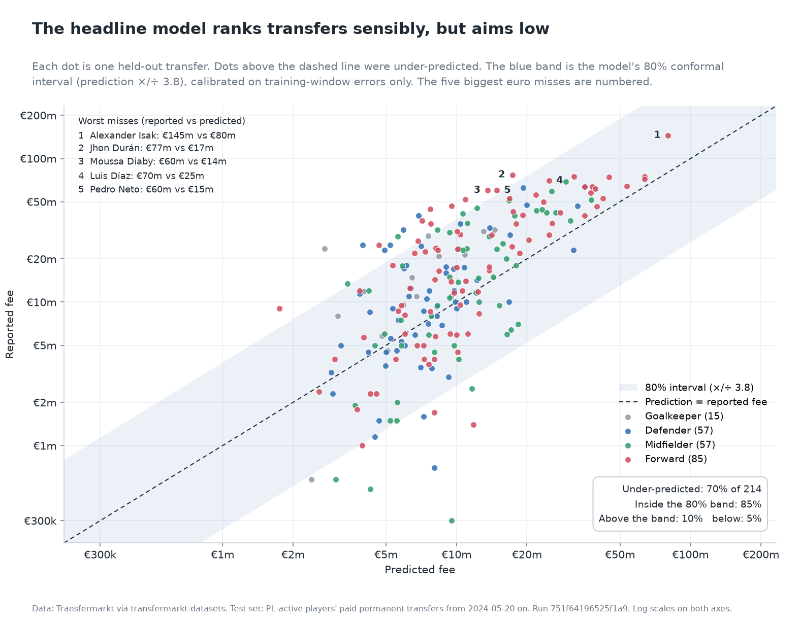
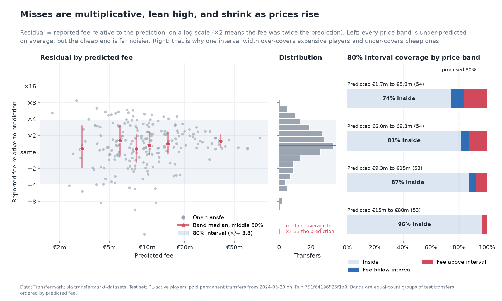
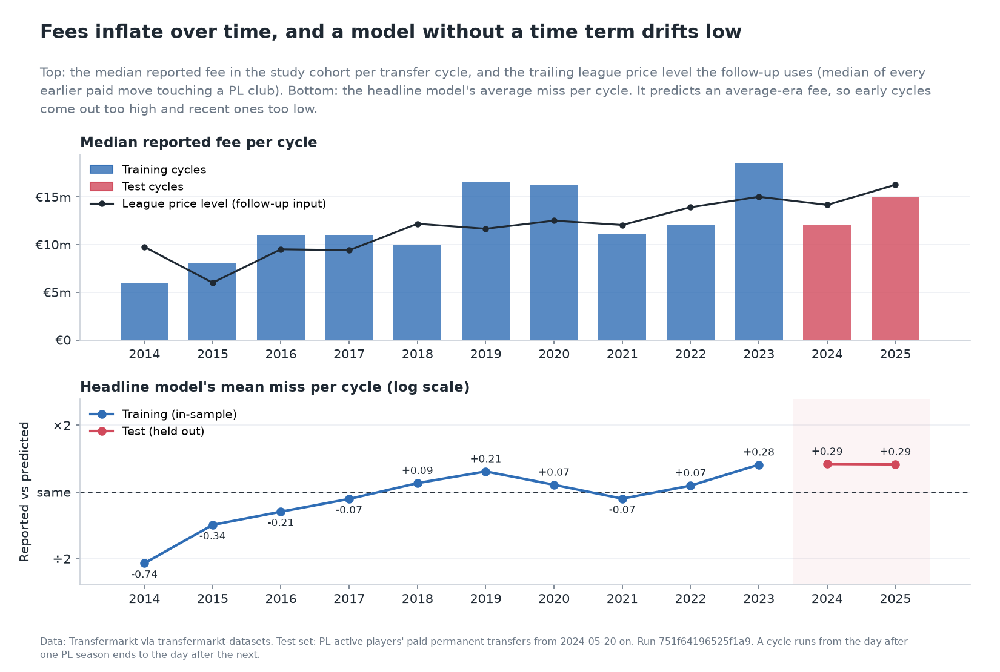
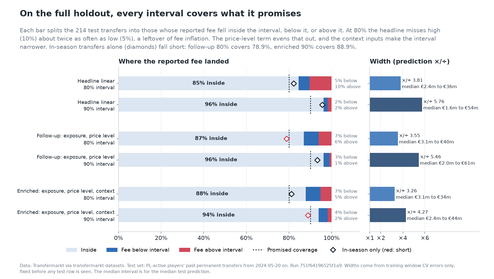
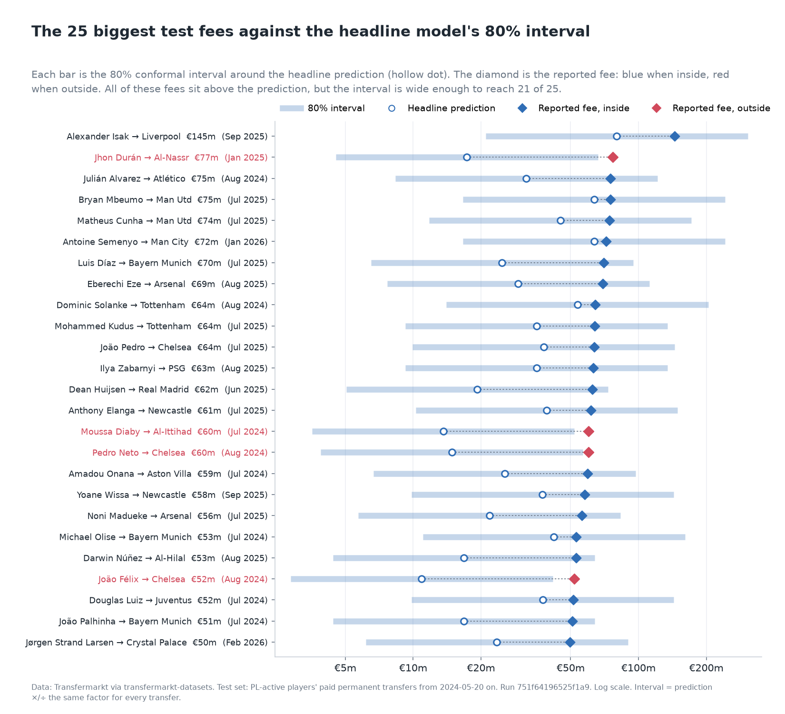
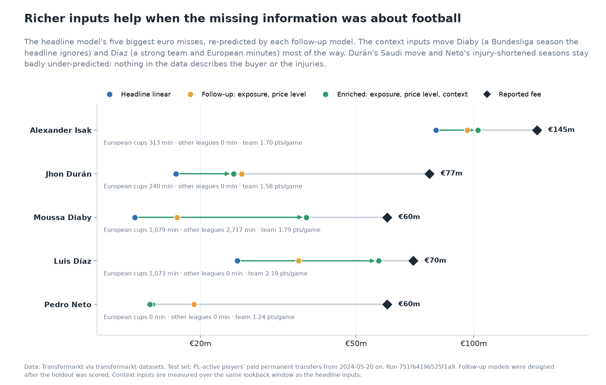
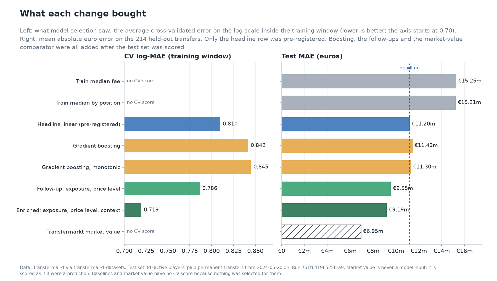
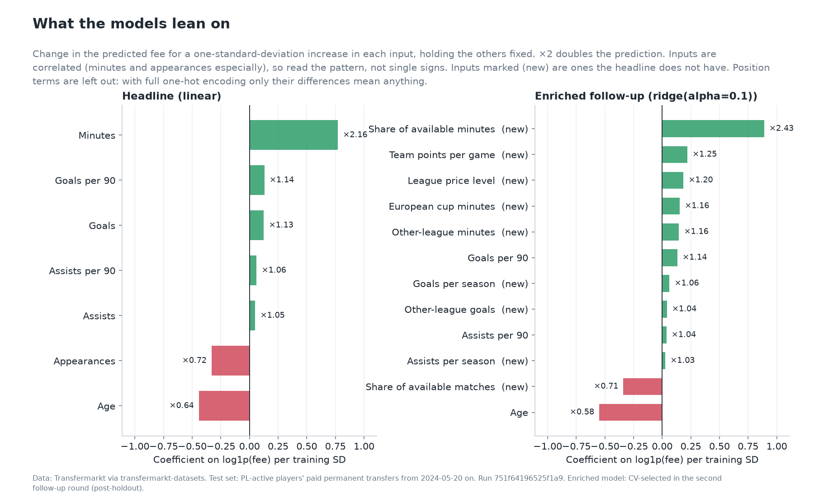

# Transfer Value Predictor

**A methodology study of PL-active players' reported transfer fees.**

> Among players with recent Premier League minutes, how much of their **reported** transfer fee can recent PL performance, age, and position explain on a later time holdout, and where does a linear model fail?

Short answer: a plain linear model on `log1p(fee)` beats every naive baseline by about €4m of mean absolute error, and the bootstrap interval excludes zero. It is still wrong by €11m on an average transfer, it under-predicts 70% of test transfers, and it misses elite and Saudi-bound forwards by €45m to €65m. Jump to the [five worst misses](#five-worst-misses).

A [follow-up designed after the holdout was opened](#follow-up-after-the-holdout-not-a-headline-result) adds exposure-normalized inputs and a fee-inflation term, picked by the same training-window CV. It cuts test MAE by about €1.6m. A second post-holdout round adds as-of context from the same raw snapshot (European cup minutes, other-league minutes and goals, team points per game). That improves CV clearly, but on the test set it is not distinguishable from the first follow-up. Transfermarkt's own market value, shown as a comparison row only, still beats every model here. The headline numbers below are the pre-registered run and are unchanged.

<!-- BEGIN:interval_summary -->
How wide is the honest range? A split-conformal interval around the headline model was sized for a nominal 80% using only training-window CV errors, before any test row was scored. It comes out at a factor of 3.81 either way: for the median test prediction of €9.3m, that is €2.4m to €35.6m. On the holdout it then covered 85% of the 214 test transfers ([details](#how-wide-is-the-range-added-after-the-holdout)).
<!-- END:interval_summary -->

Gradient boosting, with or without monotonic constraints, [does not fix the compressed elite fees](#follow-up-after-the-holdout-not-a-headline-result).

## What this is, and what it is not

- **Is:** a leakage-controlled, time-split study of paid permanent transfers of players with enough recent PL minutes, **regardless of destination club**. One row per transfer.
- **Is:** a failure analysis. The interesting output is where and why the model misses.
- **Is not:** a player valuation tool, a price recommendation, or betting advice.
- **Is not:** "all transfers into the Premier League". Newcomers without qualifying PL minutes are outside the cohort.
- **Label:** the reported fee from Transfermarkt, not Transfermarkt's market value. Market value is never a model input.

## Results

All six methods are scored on the same test transfers. Baselines are fit on training labels only. The model marked in bold was chosen by chronological cross-validation inside the training window **before** the test set was scored.

<!-- BEGIN:results -->
| Method | Selected by CV | Test MAE | Median AE | RMSE | Test log-MAE | Test rows |
| --- | --- | ---: | ---: | ---: | ---: | ---: |
| Train median fee |  | €15.25m | €9.20m | €23.06m | 0.929 | 214 |
| Train mean fee |  | €15.47m | €12.25m | €21.21m | 0.940 | 214 |
| Train median fee by position |  | €15.21m | €8.80m | €22.79m | 0.935 | 214 |
| **LinearRegression** | yes | €11.20m | €6.54m | €16.44m | 0.719 | 214 |
| Ridge |  | €11.20m | €6.53m | €16.43m | 0.719 | 214 |
| ElasticNet |  | €11.59m | €6.78m | €17.00m | 0.723 | 214 |

Split: train `transfer_date < 2024-05-20` (480 transfers, cycles 2014–2023); test `>= 2024-05-20` (214 transfers, 203 players, 2024-07-01 to 2026-02-07, cycles 2024, 2025). Predictions clamped at zero: 0.
<!-- END:results -->

Paired bootstrap on the difference in test MAE between the selected model and each baseline:

<!-- BEGIN:bootstrap -->
| Baseline | ΔMAE (model − baseline) | 95% CI | Reading |
| --- | ---: | --- | --- |
| Train mean fee | −€4.27m | −€5.76m to −€2.78m | model MAE lower; interval excludes zero |
| Train median fee | −€4.05m | −€5.52m to −€2.75m | model MAE lower; interval excludes zero |
| Train median fee by position | −€4.02m | −€5.40m to −€2.74m | model MAE lower; interval excludes zero |

5,000 paired replicates, seed 42, resampling unit: player (203 unique test players; 11 with more than one test transfer). Negative favors the model. The interval covers holdout sampling noise only; it does not include retraining or future drift.
<!-- END:bootstrap -->

Cross-validation inside the training window (selection objective: mean fold MAE on `log1p(fee)`):

<!-- BEGIN:cv -->
| Family | Best params | CV log-MAE | Fold SD | Per fold | Selected |
| --- | --- | ---: | ---: | --- | --- |
| LinearRegression | none | 0.8097 | 0.0580 | 0.757 / 0.782 / 0.890 | yes |
| Ridge | alpha=0.1 | 0.8097 | 0.0580 | 0.757 / 0.782 / 0.890 |  |
| ElasticNet | alpha=0.1, l1_ratio=0.15 | 0.8240 | 0.0575 | 0.795 / 0.773 / 0.904 |  |

Folds: cycle 2021 (276 train / 49 validation), cycle 2022 (325 train / 70 validation), cycle 2023 (395 train / 85 validation). Tie-break: mean_log_mae rounded to 4 dp; std_log_mae rounded to 4 dp; grid order.
<!-- END:cv -->

Model selection used log-MAE; the headline is euro MAE on the holdout. These are different objectives, and minimizing one does not minimize the other.

## Charts

These charts are drawn by `tvp charts` from the verified headline run and the follow-up outputs. That stage fits nothing and only reads files whose hashes it checks. The run's original evaluation figures are unchanged in [`docs/results/figures/`](docs/results/figures/). The shaded interval in the first two charts comes from the [conformal section](#how-wide-is-the-range-added-after-the-holdout), which was added after the holdout. Everything else in them is the pre-registered headline model.



**How to read it.** Each dot is one of the 214 test transfers, placed by what the headline model predicted (across) and what was reported (up). Both axes are log scales, so equal distances mean equal ratios, and a €1m miss on a €2m player looks as big as a €50m miss on a €100m one. Dots on the dashed diagonal were predicted exactly. Dots above it were under-predicted.

**What it shows.** The cloud rises with the diagonal, so the model gets the order roughly right: players it rates higher do tend to cost more. But most of the cloud sits above the line, and its vertical spread is wide. The blue band is the 80% interval: the prediction multiplied or divided by one fixed factor. It contains more than 80% of the dots, and more of the dots outside it sit above it than below. The numbered points are the five worst euro misses, all forwards and all well above the band's centre. The figures behind the chart:

<!-- BEGIN:predicted_vs_reported -->
Headline model on the 214 test transfers: 70% under-predicted. 80% band ×/÷ 3.81: 85% inside, 10% above the upper end, 5% below the lower end. Numbered worst misses: 1 Alexander Isak (FW) €145.0m against €80.1m, ×1.81 the prediction, inside the band; 2 Jhon Durán (FW) €77.0m against €17.3m, ×4.44 the prediction, above the band; 3 Moussa Diaby (FW) €60.0m against €13.6m, ×4.41 the prediction, above the band; 4 Luis Díaz (FW) €70.0m against €24.8m, ×2.82 the prediction, inside the band; 5 Pedro Neto (FW) €60.0m against €14.8m, ×4.04 the prediction, above the band.
<!-- END:predicted_vs_reported -->



**How to read it.** The vertical axis is the reported fee as a multiple of the prediction: "×2" means the fee was twice the prediction, "÷2" half. The left panel splits the test set into six equal-size bands by predicted fee. For each band, the red dot is the median miss and the red bar covers the middle half of the misses. The middle panel is the same misses as a histogram. The right panel asks how often the fixed-width 80% interval contained the fee within each quarter of the predicted-fee range.

**What it shows.** Three things. First, every band's median sits above "same", so the lean toward under-prediction holds at every price, not just for the stars. Second, the misses get tighter as the prediction rises: the middle half of the cheapest band spans a much wider factor than the most expensive band's. Cheap transfers are noisy, and expensive ones are more predictable in ratio terms, even though their euro errors are larger. Third, because the interval uses one width for everyone, it under-covers the cheapest quarter and over-covers the most expensive one. A width that depended on the predicted fee would fix this, but that is a design choice to make before looking at a test set, not after. The exact figures behind the chart:

<!-- BEGIN:residual_spread -->
Log residual by predicted-fee band, cheapest first: €1.7m to €5.2m (36): median +0.15, middle half 1.72 (a factor of 5.6); €5.2m to €7.1m (36): median +0.48, middle half 1.22 (a factor of 3.4); €7.2m to €9.3m (36): median +0.13, middle half 1.15 (a factor of 3.2); €9.3m to €11.7m (36): median +0.28, middle half 0.93 (a factor of 2.5); €11.8m to €18.3m (35): median +0.35, middle half 0.89 (a factor of 2.4); €18.6m to €80.1m (35): median +0.46, middle half 0.51 (a factor of 1.7). Headline 80% interval coverage by predicted-fee quarter: €1.7m to €5.9m (54): 74%; €6.0m to €9.3m (54): 81%; €9.3m to €14.6m (53): 87%; €14.8m to €80.1m (53): 96%.
<!-- END:residual_spread -->



**How to read it.** The top panel is the median reported fee in the study cohort per transfer cycle (red for the two test cycles). The black line is the trailing league price level the follow-up uses. The bottom panel is the headline model's average miss per cycle, on the same "multiple of the prediction" scale as above.

**What it shows.** The headline model has no notion of time, so it learns an average-era fee. That makes it too high for the early cycles and too low for the recent ones, including both test cycles (per-cycle figures below). The test-set lean is the continuation of a trend visible inside the training window. It is not bad luck on the holdout. That is the diagnosis the follow-up's price-level term acts on.

<!-- BEGIN:fee_drift -->
Reported fee as a multiple of the headline prediction (exp of the mean log residual) by cycle. Training, in-sample: 2014 ×0.48, 2015 ×0.71, 2016 ×0.81, 2017 ×0.93, 2018 ×1.10, 2019 ×1.24, 2020 ×1.08, 2021 ×0.93, 2022 ×1.07, 2023 ×1.33. Test: 2024 ×1.34, 2025 ×1.33.
<!-- END:fee_drift -->

### What the errors look like

<!-- BEGIN:diagnostics -->
- 70% of test transfers were under-predicted. Mean residual €9.1m, median €4.6m; mean log residual +0.289 (predictions about 1.33× too low on the log scale).
- Mean in-sample log residual of the selected model by training cycle: 2014: -0.74, 2015: -0.34, 2016: -0.21, 2017: -0.07, 2018: +0.09, 2019: +0.21, 2020: +0.07, 2021: -0.07, 2022: +0.07, 2023: +0.28. Test cycles: 2024: +0.29, 2025: +0.29.
- Median reported fee by cycle: 2014: €6.0m, 2015: €8.0m, 2016: €11.0m, 2017: €11.0m, 2018: €10.0m, 2019: €16.5m, 2020: €16.2m, 2021: €11.1m, 2022: €12.0m, 2023: €18.5m, 2024: €12.0m, 2025: €15.0m.

| Position | Test rows | MAE | Median residual |
| --- | ---: | ---: | ---: |
| DF | 57 | €8.10m | €1.87m |
| FW | 85 | €13.95m | €7.25m |
| GK | 15 | €8.97m | €7.88m |
| MF | 57 | €10.77m | €3.62m |
<!-- END:diagnostics -->

Two patterns stand out, both computed after model selection and not fed back into the model:

1. **Time drift.** In-sample residuals climb from strongly negative in the 2014 cycle to positive by 2023. Fees are nominal euros and the model has no time term, so it effectively predicts an average-era fee and lands low on the latest cycles. Adding a time term after seeing the test set would be tuning on the holdout, so the headline model does not get one. The [follow-up section](#follow-up-after-the-holdout-not-a-headline-result) tries it as a separately labelled experiment.
2. **Retransformation.** `expm1` of a log-scale prediction estimates something closer to a conditional median than a mean. That pulls euro predictions down for a right-skewed target. No smearing correction is applied.

## Five worst misses

The five largest absolute euro errors of the selected model, ranked deterministically (ties broken by transfer ID). All five are forwards, and all five are under-predictions.

<!-- BEGIN:misses -->
| # | Player | Move | Date | Reported | Predicted | Residual | Age | Pos | Lookback |
| ---: | --- | --- | --- | ---: | ---: | ---: | ---: | --- | --- |
| 1 | Alexander Isak | Newcastle → Liverpool | 2025-09-01 | €145.0m | €80.1m | +€64.9m | 25 | FW | 5040 min, 44 G, 8 A (2023,2024) |
| 2 | Jhon Durán | Aston Villa → Al-Nassr | 2025-01-31 | €77.0m | €17.3m | +€59.7m | 21 | FW | 1214 min, 12 G, 0 A (2022,2023,2024) |
| 3 | Moussa Diaby | Aston Villa → Al-Ittihad | 2024-07-24 | €60.0m | €13.6m | +€46.4m | 25 | FW | 2186 min, 6 G, 8 A (2023) |
| 4 | Luis Díaz | Liverpool → Bayern Munich | 2025-07-30 | €70.0m | €24.8m | +€45.2m | 28 | FW | 5059 min, 21 G, 12 A (2023,2024) |
| 5 | Pedro Neto | Wolves → Chelsea | 2024-08-11 | €60.0m | €14.8m | +€45.2m | 24 | FW | 2489 min, 2 G, 10 A (2022,2023) |
<!-- END:misses -->

**1. Alexander Isak, Newcastle to Liverpool (2025-09-01).** This is the model's highest prediction in the test set, so it ranks him correctly. It still sits €65m short. His lookback is excellent (0.79 goals per 90 over two full seasons), but an additive log-linear model has no way to reach a record fee. *Hypotheses, not observed in the data:* scarcity of elite strikers, competitive bidding, contract situation.

**2. Jhon Durán, Aston Villa to Al-Nassr (2025-01-31).** 55 appearances but only 1,214 minutes, so most of them were off the bench. Minutes is the model's largest coefficient, so a high per-90 rate on few minutes still produces a low prediction. *Hypotheses:* buying-club wealth (a Saudi Pro League destination), age 21 with perceived upside.

**3. Moussa Diaby, Aston Villa to Al-Ittihad (2024-07-24).** Only one PL season in the lookback because he arrived from the Bundesliga in 2023. The feature set is PL-only by design, so his earlier record is invisible. *Hypotheses:* buying-club wealth, non-PL track record, the price Villa had paid a year earlier.

**4. Luis Díaz, Liverpool to Bayern Munich (2025-07-30).** Two full seasons (5,059 minutes, 21 goals, 12 assists) but age 28. Age carries a strong negative coefficient. *Hypotheses:* elite-to-elite moves price in things the model cannot see, such as international profile and a short list of comparable wingers.

**5. Pedro Neto, Wolves to Chelsea (2024-08-11).** 2,489 minutes across two seasons (injury-limited) with 2 goals and 10 assists. Low minutes and low goals both push the prediction down. *Hypotheses:* chance creation that goals and assists undercount, and buyers discounting injury-shortened seasons.

Common thread: three of five had limited PL minutes in the lookback, two went to Saudi clubs, and the one elite striker with a full record was still compressed toward the middle. Residuals alone cannot say which factor dominated in any case.

## How wide is the range? (added after the holdout)

A point estimate hides how wrong the model usually is. This section wraps the **headline model** in a split-conformal interval. It was designed after the holdout had been scored, so it is not pre-registered, but nothing in it was tuned on the test set:

- **Calibration** uses only the training window: the absolute `log1p(fee)` errors each expanding CV fold made on its validation cycle (the same folds that picked the model). The width is the ⌈(n + 1) × level⌉-th smallest of those n errors.
- **Interval**: `expm1(prediction ∓ q)`, with the lower end clamped at zero. It is symmetric on the log scale, so it runs further above the prediction than below it in euros. It also converts exactly, which avoids the retransformation problem above.
- **Nominal levels** 80% and 90% were fixed before test coverage was computed. `tvp predict` prints the 80% interval.

The same procedure is repeated once for the two follow-up models further down, as a comparison. That answers whether the price-level term (and then the context inputs) makes the range narrower or the misses less lopsided.

<!-- BEGIN:conformal -->
| Model | Nominal | Calibration rows | Interval (on 1 + fee) | Test coverage | Above upper | Below lower | Median test interval |
| --- | ---: | ---: | ---: | ---: | ---: | ---: | --- |
| **Headline (LinearRegression)** | 80% | 204 | ×/÷ 3.81 | 85% | 10% | 5% | €2.4m to €35.6m |
| **Headline (LinearRegression)** | 90% | 204 | ×/÷ 5.76 | 96% | 2% | 2% | €1.6m to €53.8m |
| Follow-up (exposure+price_level) | 80% | 204 | ×/÷ 3.55 | 87% | 6% | 7% | €3.1m to €39.7m |
| Follow-up (exposure+price_level) | 90% | 204 | ×/÷ 5.46 | 96% | 1% | 3% | €2.0m to €61.1m |
| Enriched follow-up (exposure+price_level+context) | 80% | 204 | ×/÷ 3.26 | 88% | 5% | 7% | €3.1m to €33.5m |
| Enriched follow-up (exposure+price_level+context) | 90% | 204 | ×/÷ 4.27 | 94% | 2% | 4% | €2.4m to €43.9m |

Headline at 80%, test coverage by cycle: 2024 81%, 2025 87%; by position: DF 86%, FW 84%, GK 80%, MF 86%; by window: in_season 82%, off_season 86%. Mean calibration residual (log scale): headline +0.185, followup +0.004, enriched -0.019. Headline worst five at 80%: Alexander Isak €145m in €21.0m to €306m (covered); Jhon Durán €77m in €4.5m to €66m (missed); Moussa Diaby €60m in €3.6m to €52m (missed); Luis Díaz €70m in €6.5m to €95m (covered); Pedro Neto €60m in €3.9m to €57m (missed).

In-season test transfers only: Headline (LinearRegression) 80% 82.2% (74 of 90); Headline (LinearRegression) 90% 95.6% (86 of 90); Follow-up (exposure+price_level) 80% 78.9% (71 of 90); Follow-up (exposure+price_level) 90% 93.3% (84 of 90); Enriched follow-up (exposure+price_level+context) 80% 81.1% (73 of 90); Enriched follow-up (exposure+price_level+context) 90% 88.9% (80 of 90). Below nominal: Follow-up (exposure+price_level) at 80% covers 78.9% (71 of 90; 14% below the lower end, 7% above the upper); Enriched follow-up (exposure+price_level+context) at 90% covers 88.9% (80 of 90; 9% below the lower end, 2% above the upper).
<!-- END:conformal -->

Reading:

- **The headline interval over-covers, and its misses are lopsided.** At 80% nominal it covers about 85% of test transfers. The CV fold models were trained on fewer rows than the final model, so their errors, and therefore the widths, are a little too large. That is the safe direction. Twice as many fees land above the interval as below it, which is the time drift from the diagnostics showing up again (the calibration errors themselves average +0.19 on the log scale).
- **The price-level term fixes the lopsidedness more than the width.** The follow-up's interval is only slightly narrower, but its misses split roughly evenly above and below. The context inputs narrow it further, most visibly at 90%.
- **The width is the finding.** "Within about 4× either way, four times in five" is how precise recent PL performance, age, and position can be about a reported fee. Coverage is marginal. It holds on average over transfers, not for any one player, and it assumes the next cycles' errors look like the last training cycles' errors.



**How to read it.** One bar per model and level. The pale part is the share of test transfers whose reported fee fell inside the interval, starting from zero so it can be compared directly with the dotted tick at the promised level (80% or 90%). The blue and red ends are fees that landed below or above the interval. The right panel is the width itself: the factor the prediction is multiplied and divided by, and what that means in euros for the median test prediction.

**What it shows.** Every pale bar reaches past its tick, so on the full holdout none of the intervals under-deliver. That does not hold in every subgroup. The diamonds show coverage for in-season (mostly January) transfers only, and the in-season line under the table above lists the exact counts. The follow-up's 80% interval and the enriched model's 90% interval both fall short of their promised level there, and in both cases the misses are mostly fees below the interval. That matches the [window finding](#did-the-winter-window-fix-work): in-season transfers are predicted too high. Coverage is promised on average over transfers, so a shortfall in one subgroup of 90 does not break it, but it is a reason not to read the interval as equally reliable for every kind of transfer. The difference between models is in the shape of the misses and the width. The headline's 80% misses fall above twice as often as below (10% against 5%). With the price-level term the split is close to even. The context inputs then shrink the 80% factor from 3.81 to 3.26 and the 90% factor from 5.76 to 4.27, without losing coverage. For a typical test transfer, the enriched model's 90% range is €2.4m to €44m against €1.6m to €54m for the headline.



**How to read it.** The 25 largest reported fees in the test set, biggest at the top. The pale bar is the headline model's 80% interval, the hollow dot its prediction, and the diamond the reported fee. Red diamonds and red names are fees outside the interval.

**What it shows.** At the top of the market the headline model is too low: the fees sit to the right of their predictions. The interval still reaches most of them, because it is wide. Durán and Diaby (both sold to Saudi clubs) and Neto (injury-shortened seasons) miss it and are also in the worst-five table. João Félix (Atlético to Chelsea) misses it without being in the worst five. His PL lookback is a single half-season loan, with the minutes and goals listed below. For these players the inputs the model sees point to a mid-table fee, and the interval is not wide enough to reach the actual one. The counts and each miss:

<!-- BEGIN:biggest_fees -->
Of the 25 largest test fees, 25 sit above the headline prediction and 21 fall inside the 80% interval. Outside it: Jhon Durán, Aston Villa → Al-Nassr (2025-01-31): €77.0m against an interval of €4.5m to €66.1m (prediction €17.3m), in the worst five; PL lookback 2022,2023,2024: 1,214 min, 55 apps, 12 G, 0 A; Moussa Diaby, Aston Villa → Al-Ittihad (2024-07-24): €60.0m against an interval of €3.6m to €51.9m (prediction €13.6m), in the worst five; PL lookback 2023: 2,186 min, 38 apps, 6 G, 8 A; Pedro Neto, Wolves → Chelsea (2024-08-11): €60.0m against an interval of €3.9m to €56.6m (prediction €14.8m), in the worst five; PL lookback 2022,2023: 2,489 min, 38 apps, 2 G, 10 A; João Félix, Atlético → Chelsea (2024-08-21): €52.0m against an interval of €2.9m to €41.6m (prediction €10.9m), not in the worst five; PL lookback 2022: 942 min, 16 apps, 4 G, 0 A.
<!-- END:biggest_fees -->

## Follow-up after the holdout (not a headline result)

Everything in this section was designed **after** the headline test set had been scored, in response to review. It is reported separately so the pre-registered numbers above stay honest. Ground rules:

- The headline run is read and verified by hash, never rewritten. The follow-up lives in its own config ([`followup.yaml`](followup.yaml)) and stage (`tvp followup`), so the headline config hash and run ID do not change.
- Variant and model choice use only the same expanding CV folds inside the training window. The unmodified headline inputs are variant #1 and win CV ties. As a check, the stage reproduces the headline CV score and test predictions exactly before it does anything else.
- Test scores for variants that CV did not pick are shown for transparency only. Picking the variant with the best test score would be tuning on the holdout.

Two problems prompted it:

1. **Winter transfers see more football.** A January transfer's lookback is two completed seasons *plus* half of the current one, so raw totals (goals, assists, minutes, appearances) are inflated compared with a summer transfer. The **exposure** inputs divide by what was available: `minutes_share` = minutes / (90 × team league matches available before D), `appearance_share` likewise, and goals and assists per lookback season, where an ongoing season counts as the share of its games played before D. Per-90 rates and age are unchanged.
2. **Nominal fee drift.** Two candidate time terms: `cycle_trend` (the transfer cycle as a number, extrapolated linearly), and `league_price_level`, the log of the median positive fee of every move in the source where the buying or selling club played in the PL that cycle, over the 365 days before D. The price level only uses moves dated strictly before D, so a transfer's own fee never enters it. It does use earlier test-period fees for later test transfers, which is information a real user would have had on that date.

That makes six variants (headline or exposure inputs, each with no time term, trend, or price level), each crossed with the same 13-model grid.

<!-- BEGIN:followup -->
| Variant | Best model | CV log-MAE | Per fold | Selected by CV | Test MAE | Test log-MAE | Mean test log residual |
| --- | --- | ---: | --- | --- | ---: | ---: | ---: |
| headline | linear | 0.8097 | 0.757 / 0.782 / 0.890 |  | €11.20m | 0.719 | +0.289 |
| headline+trend | ridge(alpha=10.0) | 0.7966 | 0.832 / 0.763 / 0.795 |  | €9.43m | 0.643 | -0.116 |
| headline+price_level | ridge(alpha=1.0) | 0.7902 | 0.764 / 0.783 / 0.823 |  | €9.71m | 0.652 | +0.075 |
| exposure | ridge(alpha=1.0) | 0.8020 | 0.772 / 0.766 / 0.868 |  | €10.93m | 0.706 | +0.275 |
| exposure+trend | elastic_net(alpha=0.1, l1_ratio=0.15) | 0.7908 | 0.814 / 0.752 / 0.807 |  | €9.65m | 0.648 | -0.062 |
| **exposure+price_level** | ridge(alpha=1.0) | 0.7864 | 0.781 / 0.768 / 0.810 | yes | €9.55m | 0.646 | +0.066 |

Selected by CV: **exposure+price_level** (ridge(alpha=1.0)). `league_price_level` coefficient +0.167 per training SD (SD 0.24). Paired bootstrap, follow-up minus headline test MAE: −€1.65m (95% CI −€2.24m to −€1.09m; 5,000 replicates, player clusters). Test columns for non-selected variants are descriptive only.

Median league price level by cycle: 2014: €9.8m, 2015: €6.0m, 2016: €9.5m, 2017: €9.4m, 2018: €12.2m, 2019: €11.7m, 2020: €12.5m, 2021: €12.1m, 2022: €13.9m, 2023: €15.0m, 2024: €14.1m, 2025: €16.3m.
<!-- END:followup -->

Reading: both time terms help in CV, and the price level helps most. Exposure normalization on its own barely moves CV. With a time term, CV prefers it by a small margin. The selected follow-up model removes most of the systematic under-prediction on the test set (compare the mean log residual with the headline's), and the improvement over the headline is larger than the bootstrap noise. The lowest test MAE actually belongs to `headline+trend` (€9.43m), which CV did not pick. It overshoots on the log scale (mean residual below zero), and choosing it now would be selecting on the test set. It is still one post-hoc experiment on one holdout, so read it as "the drift diagnosis was right", not as a new, validated headline.

<!-- BEGIN:boosting -->
**Gradient boosting did not fix the compression.** Same headline inputs, same folds, a fixed 8-point grid (`HistGradientBoostingRegressor`, learning rate 0.05). CV log-MAE: unconstrained 0.8417, monotonic 0.8448 (more goals, assists, minutes and per-90 output can only raise the prediction, more age can only lower it), against 0.8097 for the headline linear model, so CV would never have picked either. On the test set (descriptive only): test MAE €11.43m and €11.30m against €11.20m. The top of the market gets no closer: linear €80.1m for the €145m transfer, top-decile log residual +0.78, slope 1.09; boosting €52.4m for the €145m transfer, top-decile log residual +0.75, slope 1.04; monotonic €58.2m for the €145m transfer, top-decile log residual +0.74, slope 0.95. Trees cannot predict above the leaf averages they were trained on, and a slope of actual on predicted log fee near 1 says the linear predictions are not too tightly bunched for their inputs. The elite misses are a missing-information problem, not a functional-form one.
<!-- END:boosting -->

### Did the winter-window fix work?

<!-- BEGIN:window -->
| Window | Train / test rows | Test lookback seasons | Train raw minutes | Train residual (headline) | Train residual (follow-up) | Test residual (headline) | Test residual (follow-up) |
| --- | ---: | ---: | ---: | ---: | ---: | ---: | ---: |
| Off-season (no season in progress) | 304 / 124 | 2.00 | 2,459 | +0.093 | +0.083 | +0.434 | +0.206 |
| In-season | 176 / 90 | 2.20 | 2,661 | -0.161 | -0.143 | +0.089 | -0.126 |

Residuals are mean `log1p(fee) − prediction`; train columns are in-sample. Lookback seasons count an ongoing season by the share of its games played before D.
<!-- END:window -->

Not really. Exposure normalization is the right accounting, and in-season rows do carry about 0.2 extra seasons of lookback. But the residual gap between windows barely changes when the inputs are normalized. In-season transfers are still predicted too high relative to off-season transfers, in training and in test. The gap does not come from inflated totals. More plausible explanations (hypotheses, not tested): mid-season deals are a different market (relegation-threatened sellers, injury cover, less time to find competing bidders), and the ongoing half-season is the freshest evidence, so buyers may weight it differently from older seasons.

### Transfermarkt market value as a comparator

Market value is **never** a model input. Here it is scored as if it were a prediction: for each test transfer, the latest Transfermarkt valuation dated strictly before the transfer date and no more than 365 days old.

<!-- BEGIN:market_value -->
| Method | Test MAE | Median AE | Test log-MAE |
| --- | ---: | ---: | ---: |
| Train median fee | €15.25m | €9.20m | 0.929 |
| Headline model (LinearRegression) | €11.20m | €6.54m | 0.719 |
| Follow-up model (exposure+price_level) | €9.55m | €6.32m | 0.646 |
| Enriched follow-up (exposure+price_level+context) | €9.19m | €5.38m | 0.612 |
| Transfermarkt market value (comparator) | €6.95m | €4.50m | 0.496 |

Matched test rows: 214 of 214 (rule: latest valuation with valuation_date < transfer_date and at most 365 days old; median valuation age 54 days). Reported fee above market value in 54% of rows. Paired bootstrap: enriched follow-up minus market value €2.24m (95% CI €0.96m to €3.51m); follow-up model minus market value €2.60m (95% CI €1.22m to €3.98m); headline model minus market value €4.25m (95% CI €2.70m to €5.79m).
<!-- END:market_value -->

Market value beats every model comfortably. That is expected rather than embarrassing. Transfermarkt's valuers see things this feature set leaves out by design, such as contract length, injuries, and transfer rumours. A valuation posted a few weeks before a deal may already reflect the negotiation. So this is a reference point, not a ceiling, and beating or losing to it proves neither leakage nor purity.

### Second round: richer as-of inputs

The headline lookback reads Premier League matches only. The same pinned raw files also record European club competitions, about a dozen other European first-tier leagues, and every PL result since 2012. This round builds four more inputs from them under the same as-of rule (only matches strictly before the transfer date). It was designed after both the headline and the first follow-up had been scored, and the misses above motivated it, so it is a second post-hoc experiment:

- `europe_minutes`: minutes in the Champions League, Europa League, and Conference League.
- `other_league_minutes`, `other_league_goals`: minutes and goals in first-tier leagues other than the PL. This makes a recent arrival's earlier record visible, such as Diaby's Bundesliga season.
- `team_points_per_game`: mean league points the player's club took in the lookback PL matches he played. It measures how strong the team he was playing for was, not the buyer.

The first two groups use a lookback date window that runs from the first match of the earlier completed lookback season to the day before the transfer. That covers the same period as the PL lookback. Each first-round input set gets the four columns added, and the same 13-model grid and folds pick one variant. The raw files are verified against the headline run's source hashes. Destination, fee, and market value stay out.

<!-- BEGIN:context -->
| Variant | Best model | CV log-MAE | Per fold | Selected by CV | Test MAE | Test log-MAE | Mean test log residual |
| --- | --- | ---: | --- | --- | ---: | ---: | ---: |
| headline+context | ridge(alpha=1.0) | 0.7652 | 0.696 / 0.764 / 0.836 |  | €11.41m | 0.722 | +0.377 |
| headline+trend+context | ridge(alpha=10.0) | 0.7299 | 0.724 / 0.737 / 0.728 |  | €8.56m | 0.583 | -0.066 |
| headline+price_level+context | ridge(alpha=1.0) | 0.7204 | 0.653 / 0.753 / 0.755 |  | €9.49m | 0.622 | +0.146 |
| exposure+context | ridge(alpha=10.0) | 0.7622 | 0.715 / 0.751 / 0.821 |  | €11.01m | 0.697 | +0.334 |
| exposure+trend+context | ridge(alpha=10.0) | 0.7268 | 0.730 / 0.738 / 0.712 |  | €8.61m | 0.581 | -0.055 |
| **exposure+price_level+context** | ridge(alpha=0.1) | 0.7193 | 0.672 / 0.750 / 0.736 | yes | €9.19m | 0.612 | +0.141 |

Selected by CV: **exposure+price_level+context** (ridge(alpha=0.1)), CV log-MAE 0.7193 against 0.7864 for the first-round follow-up. Coefficients per training SD: `team_points_per_game` +0.219, `europe_minutes` +0.152, `other_league_minutes` +0.146. CV with one context group removed from the selected variant: without europe 0.7029; without other league 0.7292; without team 0.7504. Paired bootstrap on test MAE, enriched minus headline −€2.01m (95% CI −€2.95m to −€1.12m); enriched minus first-round follow-up −€0.36m (95% CI −€1.11m to €0.37m). Rows with any European minutes: train 48%, test 43%; with other-league minutes: train 37%, test 41%.

The headline's five worst misses under each model:

| Player | Reported | Headline | Follow-up | Enriched | European min | Other-league min | Team pts/game |
| --- | ---: | ---: | ---: | ---: | ---: | ---: | ---: |
| Alexander Isak | €145.0m | €80.1m | €96.3m | €102.4m | 313 | 0 (0 G) | 1.70 |
| Jhon Durán | €77.0m | €17.3m | €25.5m | €24.3m | 240 | 0 (0 G) | 1.58 |
| Moussa Diaby | €60.0m | €13.6m | €17.4m | €37.3m | 1,079 | 2,717 (9 G) | 1.79 |
| Luis Díaz | €70.0m | €24.8m | €35.7m | €57.1m | 1,073 | 0 (0 G) | 2.19 |
| Pedro Neto | €60.0m | €14.8m | €19.3m | €14.8m | 0 | 0 (0 G) | 1.24 |
<!-- END:context -->

Reading: this is the biggest CV gain of anything tried here, and team strength carries most of it. Removing it costs the most, and a player's club's results say something performance totals do not. The CV gain mostly does not carry over to euros on the test set. The enriched model beats the headline by a margin larger than the bootstrap noise, but against the first-round follow-up the interval includes zero. The ablation also shows that European minutes add nothing once the other inputs are in (CV improves slightly without them). They stay in because the variant set was fixed before the ablation ran, and dropping them now would be one more round of selection. Among the worst misses, the new inputs help where the missing information was about football: Diaby (Bundesliga record) and Díaz (Liverpool's results and European minutes) move much closer. They do not help where it was about the buyer or the injury record. Durán's Saudi move barely changes, and Neto does not change at all. Isak moves up but stays well short.



**How to read it.** One row per headline worst miss. The dots are the three models' predictions (blue headline, gold first follow-up, green enriched), and the black diamond is the reported fee. The green arrow runs from the headline prediction to the enriched one, so a long arrow toward the diamond means the new inputs closed most of the gap. The grey line under each name lists the context inputs the enriched model saw for that player.

**What it shows.** The arrows are long for Diaby and Díaz and short for Durán and Neto, and the context line says why. Diaby has 2,717 minutes in another league and over 1,000 European minutes. Díaz has the highest team points per game of the five (2.19, at Liverpool) and over 1,000 European minutes. Durán and Neto have little or none of either, so the enriched model has nothing new to go on. Isak gains about €22m across the two rounds, most of it from the price-level term, but the diamond is still far to the right.



**How to read it.** Every model in this README on one chart. The left panel is the number model selection actually used: the average cross-validated error on the log scale inside the training window (the axis starts at 0.70 to make the differences visible). The right panel is the euro error on the test set. The dashed line marks the headline model in both panels. Only the headline row was pre-registered.

**What it shows.** The two panels mostly agree. Boosting is worse than the headline in CV and no better on the test set. Each follow-up round lowers CV, and the test error moves the same way, from €11.20m to €9.55m to €9.19m. The last step is smaller on the test set than in CV, which is what the bootstrap above says too. Transfermarkt's market value, which sees contracts, injuries, and rumours that this feature set leaves out, is still €2.24m better than the best model here.

A second data source was also checked and not used: football-data.org's API, whose free tier only serves PL seasons from 2023/24 onward and has no per-player match data beyond a top-scorer list. Nothing from it can reach the 2014 to 2023 training cycles.

## Method

- **Cohort.** Paid permanent transfers (`fee > 0`) whose player has at least 90 Premier League minutes in the lookback window. Destination is unrestricted.
- **Row grain.** One row per transfer. A player can appear more than once, but a transfer never appears in both train and test.
- **Lookback (as-of rule).** For a transfer recorded on date `D`: league appearances with `match_date < D` from the **two latest source PL seasons completed before `D`**, plus the pre-`D` matches of a season still in progress at `D`. A season is complete only when all 380 games are present and played, and its completion date is its last match. No July-to-June buckets. A July transfer usually has no season in progress. The extended 2019/20 season (last match 2020-07-26) counts as in progress for a mid-July 2020 transfer and as completed in August.
- **Features.** Goals, assists, minutes, appearances, goals per 90, assists per 90, age at `D` (floor years from date of birth), and position. Per-90 values require at least 90 minutes, and rows below that are dropped, never zero-filled.
- **Position.** The most frequent lineup position across the same lookback appearances, mapped to GK/DF/MF/FW (fixed tie-break order). If a player has no lineup rows, the current profile position is used as a **retrospective proxy**, flagged per row. Proxy rows are exempt from the strict as-of claim.
- **Target.** `log1p(fee_eur)`. Euro predictions are `max(expm1(prediction), 0)`.
- **Models.** LinearRegression, Ridge (`alpha` 0.1, 1, 10, 100), and ElasticNet (`alpha` 0.1, 1, 10 × `l1_ratio` 0.15, 0.5, 0.85). All share one scikit-learn `Pipeline`: `StandardScaler` on numeric inputs, `OneHotEncoder(handle_unknown="ignore")` on position, and an explicit input allowlist.
- **Transfer cycles.** Cycle *s* runs from the day after season *s−1*'s last match to the day after season *s*'s last match, which keeps each summer window in one piece. The study window is cycles 2014 to 2025 (2014 is the first cycle with two completed seasons of lookback in the source).
- **Split.** `T = 2024-05-20`, the start of the 2024 cycle (the day after the 2023/24 season ended). Train: `transfer_date < T`. Test: `transfer_date >= T`, which covers the last two cycles.
- **Selection.** Expanding chronological folds: each of the last three training cycles is validated by a model trained on all earlier cycles. Preprocessing is refit inside every fold. The best candidate per family is refit on the whole training window, and the overall CV winner is fixed before the holdout is opened. CV differences below 1e-4 log-MAE count as ties and fall back to the fixed grid order (Ridge with `alpha=0.1` and OLS differed by 6e-8).
- **Uncertainty.** A paired bootstrap resamples unique test players with replacement and keeps all of each player's transfers, including repeats when a player is drawn twice. It uses 5,000 replicates, seed 42, and the same draws for the model and every baseline.

## Leakage checklist

- [x] Every contributing appearance satisfies `match_date < transfer_date`, and same-day matches are excluded. See [`tests/test_leakage.py`](tests/test_leakage.py).
- [x] Source season metadata defines the two completed seasons and any in-progress prefix. See [`tests/test_features.py`](tests/test_features.py) for the summer gap and the extended 2019/20 season.
- [x] The current-position fallback is flagged and reported with total, train, and test percentages (funnel section below).
- [x] No destination-club, fee-derived, or market-value inputs. The pipeline rejects forbidden columns: [`features.assert_allowed_inputs`](src/transfer_value/features.py). The one exception is the follow-up's `league_price_level`, a trailing median of *other*, strictly earlier transfers' fees. It never includes the row's own fee, and it is not part of the headline model.
- [x] The second-round context inputs (European and other-league minutes, team points) only count matches strictly before the transfer date. They come from the headline run's own raw files, verified by hash. See [`tests/test_followup.py`](tests/test_followup.py).
- [x] Conformal widths come from training-window CV errors only; the test set never touches them.
- [x] Joins use IDs only, and no transfer ID appears in both train and test. See [`tests/test_split.py`](tests/test_split.py).
- [x] Scalers and encoders are fit inside each fold's training rows, through one `Pipeline`.
- [x] Baselines use training labels only, including the position-median fallback. See [`tests/test_evaluate.py`](tests/test_evaluate.py).
- [x] Selection uses only the training window. Headline numbers use `transfer_date >= T`.

Worked example, mirrored in `tests/test_leakage.py` with a fixture player:

| Field | Allowed construction | Rejected construction |
|---|---|---|
| Player, recorded transfer date | Alex Example, 2023-07-15 | Same player and date |
| Completed-season lookback | PL matches in 2021/22 and 2022/23 | A July-to-June bucket described as a completed season |
| Transfer-day and later appearances | Excluded | Goals on 2023-07-15 or in August 2023 enter the aggregates |
| Market value dated 2023-08-01 | Not a model input | Used to predict the July fee |
| Current profile position | Allowed only with a proxy flag | Described as known before the deal without evidence |

The test adds a same-day and a later appearance with goals and asserts that every performance feature is unchanged. A separate test asserts that market value cannot be passed into the pipeline.

## Coefficients in plain English

Selected model (LinearRegression), fit on the training window:

<!-- BEGIN:coefficients -->
| Term | Kind | Coefficient (log1p fee) | exp(coef) | 1 training SD = |
| --- | --- | ---: | ---: | ---: |
| `goals` | num | +0.125 | ×1.134 | 7.15 |
| `assists` | num | +0.050 | ×1.051 | 4.24 |
| `minutes` | num | +0.771 | ×2.162 | 1,893 |
| `appearances` | num | -0.330 | ×0.719 | 22 |
| `goals_per90` | num | +0.130 | ×1.139 | 0.166 |
| `assists_per90` | num | +0.062 | ×1.064 | 0.133 |
| `age` | num | -0.442 | ×0.643 | 3.32 |
| `position_DF` | cat | -0.079 | ×0.924 |  |
| `position_FW` | cat | +0.077 | ×1.080 |  |
| `position_GK` | cat | -0.106 | ×0.900 |  |
| `position_MF` | cat | +0.108 | ×1.114 |  |
| `(intercept)` | intercept | +16.122 |  |  |
<!-- END:coefficients -->

How to read this:

- Numeric inputs are standardized. A coefficient is the change in predicted `log1p(fee)` for a **one training-SD increase** in that input, holding the other inputs fixed. `exp(coef)` multiplies `1 + fee`; it is not a euro amount.
- **Minutes** dominate: one SD more minutes (about 1,900) roughly doubles the prediction. Being a regular starter is the strongest signal this feature set has.
- **Appearances** are negative *given minutes*: more appearances for the same minutes means more substitute outings. Minutes and appearances are strongly correlated, so neither sign should be read alone.
- **Age** is strongly negative: one SD older (about 3.3 years) cuts the prediction by roughly a third, consistent with buyers paying for resale value (a hypothesis).
- **Goals** and **goals per 90** both help and overlap heavily. **Assists** add little once goals and minutes are known.
- **Position** uses full one-hot encoding with an intercept, so a single position coefficient is not identifiable on its own. Only differences between positions mean anything: midfielders and forwards come out above defenders, and goalkeepers lowest.



**How to read it.** The same coefficients as the table, turned into multipliers: each bar is what a one-standard-deviation increase in that input does to the prediction, with everything else held fixed. Green raises the prediction and red lowers it. The right panel is the enriched follow-up model (post-holdout) for comparison, and "(new)" marks inputs the headline does not have.

**What it shows.** Both models are mostly about playing time and age. In the headline, minutes are worth ×2.16 per SD and age ×0.64. In the enriched model, the share of available minutes takes over as the top input (×2.43), and age gets a bit stronger (×0.58). The new inputs that matter most after that are team points per game (×1.25) and the league price level (×1.20). In both models, goals and assists matter far less than playing time. The negative appearances and share-of-matches bars are the same "substitute outings" effect described above, not a penalty for playing.
- None of this is causal. The inputs are collinear and the coefficients describe this fitted model, not the transfer market.

## Data provenance and filters

Data: [Transfermarkt](https://www.transfermarkt.com/) via the community [transfermarkt-datasets](https://github.com/dcaribou/transfermarkt-datasets) by David Cariboo ([Kaggle mirror](https://www.kaggle.com/datasets/davidcariboo/player-scores)). All rights remain with Transfermarkt and the dataset maintainers. Raw files are not committed. [`data/raw/SOURCE.md`](data/raw/SOURCE.md) pins the URL, byte size, and SHA-256 of every file. The upstream collection paused in July 2026, so this snapshot is effectively frozen.

How fees and loans are encoded: the source has no transfer-type or loan column. Upstream parses the Transfermarkt fee string so that `-`, `?`, and blank become null, `free transfer` becomes 0, strings starting with `€` are parsed, and **every other string becomes 0**. That last group covers "loan transfer", "End of loan", and "Loan fee: €X". So a positive fee is a paid permanent move, while free transfers, loans (paid or not), and loan returns all share a fee of 0 and are excluded together. Spot checks against known paid loans (Lukaku to Inter 2022, Cancelo to Bayern 2023, Sancho to Chelsea 2024) all show 0.

Sequential funnel (each dropped row has exactly one first-failure reason):

<!-- BEGIN:funnel -->
| Step | Rows | Dropped | Reason / note |
| --- | ---: | ---: | --- |
| raw transfer rows after exact dedup | 175,165 |  |  |
| valid player ids | 175,165 | 0 | missing_player_id |
| valid transfer dates | 175,165 | 0 | missing_transfer_date |
| in study window | 150,219 | 24,946 | outside_study_window |
| fee field present | 100,322 | 49,897 | undisclosed_fee |
| fee well formed | 100,322 | 0 | malformed_fee |
| positive reported fee | 16,106 | 84,216 | zero_fee_free_or_loan |
| classified permanent | 16,106 | 0 | Implied by a positive fee under the source encoding (loans are recorded as 0). |
| classified non loan | 16,106 | 0 | Implied by a positive fee under the source encoding (loans are recorded as 0). |
| unique transfer identity | 16,106 | 0 | Natural key unique; conflicts fail ingest. |
| lookback coverage available | 16,106 | 0 | no_lookback_coverage |
| league active candidates | 760 | 15,346 | no_league_appearances_in_lookback |
| sufficient lookback minutes | 694 | 66 | insufficient_lookback_minutes |
| valid per90 features | 694 | 0 | invalid_per90 |
| usable age | 694 | 0 | missing_age |
| usable position | 694 | 0 | missing_position |
| final supervised rows | 694 |  |  |

Position source in the final cohort: current_proxy 5, historical_appearance 689 (0.72% proxy overall; train 1.04%, test 0.0%). Rows per cycle: 2014: 25, 2015: 33, 2016: 43, 2017: 54, 2018: 35, 2019: 55, 2020: 31, 2021: 49, 2022: 70, 2023: 85, 2024: 97, 2025: 117. Possible loans or buy-backs (a paid move followed within 400 days by a zero/unknown-fee move back to the seller): 4 of 694 final rows (1 in test); kept, disclosed here.
<!-- END:funnel -->

## Quickstart

One path, $0, no API keys. The only network step is the explicit download.

```bash
uv sync --locked --extra dev
uv run --locked python scripts/fetch_data.py --config config.yaml   # ~190 MB, verified against pinned hashes
uv run --locked tvp pipeline --config config.yaml                    # feasibility → ingest → features → train → evaluate
uv run --locked python scripts/fetch_data.py --config followup.yaml # follow-up only: player_valuations.csv.gz (~7 MB)
uv run --locked tvp followup --config followup.yaml                  # post-holdout follow-up; reads, never rewrites, the headline run
uv run --locked tvp charts --config followup.yaml                    # report charts from the verified run and follow-up; fits nothing
uv run --locked python scripts/build_report.py --config config.yaml  # publish docs/results/ and refresh README numbers
```

If you downloaded the files yourself (for example from Kaggle), pass the folder with `tvp feasibility --input-dir <dir>`. The files must match the pinned hashes. `pip install -e ".[dev]"` also works but ignores `uv.lock`.

Offline checks (these are what CI runs):

```bash
uv run --locked ruff format --check . && uv run --locked ruff check .
uv run --locked pytest
uv run --locked python scripts/build_report.py --check
```

## Prediction CLI (demo only)

`tvp predict` reuses the saved headline model and the same feature builder. It refuses dates the model could have seen in training and dates beyond source coverage. The default as-of date is the end of the 2025/26 season. After `tvp followup` has run, it also prints the headline model's 80% [training-set conformal interval](#how-wide-is-the-range-added-after-the-holdout). It checks that the interval was calibrated for the same run and model.

The output below is hand-copied from a terminal against run `751f64196525f1a9`. It is not one of the blocks that `build_report.py` generates, so `--check` does not compare it with the published files. Re-run the commands to confirm it.

```text
$ uv run --locked tvp predict --player "Cole Palmer"
Cole Palmer (id 568177) as of 2026-05-25
  position MF (historical_appearance), age 24
  lookback seasons 2024,2025: 5165 min, 25 G, 10 A
  hypothetical reported fee: €57.1m
  80% training-set conformal interval: €15.0m to €217.7m
  model linear, run 751f64196525f1a9
  Hypothetical estimate of a reported fee, not an observed fee or a valuation. The interval covers past transfers at its nominal rate on average; it is not a valuation range for this player.

$ uv run --locked tvp predict --player "Bukayo Saka"
  ...
  hypothetical reported fee: €33.5m
  80% training-set conformal interval: €8.8m to €127.8m
```

The Saka point estimate is the compression problem from the worst-misses section in one line. The interval is the honest version of the same output: this feature set can only place him somewhere between €9m and €128m. Treat these outputs as illustrations of the model's behavior, not estimates anyone should use, and not as valuations.

## What I would not claim

This study does **not** establish:

- A player's true value or a recommended transfer price.
- Anything about all transfers into the Premier League, or about players without qualifying PL minutes.
- Knowledge available before negotiations or agreement. The cutoff is the *recorded* transfer date, which can follow the agreement.
- Strictly historical position for the flagged proxy rows.
- A causal explanation for any residual or coefficient sign.
- That the model is better than the baselines in general. The bootstrap describes this holdout only, not future seasons or retraining.
- That a conformal interval is a range for a particular player. Its coverage holds on average over transfers like the calibration ones.
- That the second-round context inputs are a validated improvement. They were chosen after two looks at the test set, and their test gain over the first follow-up is within noise.

## Limitations

- **Hypotheses for large residuals** (not established causes): negotiation, contract length, buying-club wealth, and hype are intentionally outside the feature set. Residuals alone cannot show which factor dominated.
- **Selection bias:** only known, positive-fee permanent transfers of PL-active players. Undisclosed fees, free transfers, and all loans (including paid loan fees) are excluded, and many newcomers and non-PL paths are out of scope.
- **Reported fees:** Transfermarkt figures are reported or estimated, not ledger values. Add-ons may or may not be included. The recorded transfer date may follow the agreement date.
- **Retrospective position** for proxy rows (under 1% here).
- **Nominal EUR** with no inflation adjustment in the headline model, and the drift is visible in the residuals. The follow-up's price-level term addresses this, but only post hoc.
- **Transfer window:** in-season (mostly January) transfers are over-predicted relative to summer ones, and normalizing for the extra half season does not close the gap.
- **Elite outliers:** the linear model compresses the top of the market. That is a finding, not a bug to hide. Gradient boosting, with or without monotonic constraints, compresses it at least as much.
- **PL-only lookback:** in the headline model, a player's record in other leagues is invisible, which hurts recent arrivals (Diaby). The second follow-up round adds other-league and European minutes, but only post hoc.
- **Coverage drift:** transfer histories come from each player's latest profile scrape, so early cycles are sparse (see rows per cycle in the funnel).
- **Incomplete final window:** the snapshot stops in July 2026, so the 2026 summer window is excluded rather than half-counted.
- **Possible loans or buy-backs** among positive fees are flagged in the funnel section and kept.
- Transfermarkt market value is shown as a comparator, not a ceiling. It beats every model here, and that proves neither leakage nor purity.

## Reproduce

<!-- BEGIN:reproduce -->
- Run ID `751f64196525f1a9`; code revision `d6df8bc7cc6c00896fc22734481937416f1b5a26`
- Python 3.11.15; joblib 1.6.0, matplotlib 3.11.2, numpy 2.4.6, pandas 3.0.6, pyarrow 25.0.1, scikit-learn 1.9.1, typer 0.27.2
- `uv.lock` sha256 `cecc118ae36a98afa52f2dfdbf42120bc3a4fbc66f4913bb9acb52d53fa253b9`
- Config sha256 `feca52cf88bc9a765a35b90729d6049e8b503ef67ecf9395c7eddddea4ddc919`; seed 42; study window 2014-05-12 to 2026-05-25 (exclusive), T 2024-05-20

| File | SHA-256 |
| --- | --- |
| `appearances.csv.gz` | `e096c2b158fc3d52c4550526c4d4850dd62f31007652f4bcae112eadb1646802` |
| `competitions.csv.gz` | `8924ddfbc0e9989f4a42a3c32ebb6faa671614625086d7fa84353f955352ea88` |
| `game_lineups.csv.gz` | `5e83d6fad28364aadfea608013700cf09990062eede1ad9ef189189b0af47ba2` |
| `games.csv.gz` | `142561989017d379bcf9e72bad0b87e0996bae0e7b710ebb3def9255f464c741` |
| `players.csv.gz` | `d22e407981d5b51a79bf8ff59835729f3526f7dc3495a6d8ed2f852ed2e86403` |
| `transfers.csv.gz` | `90326983daf7e6ac7aabdfe62b90936d9bf1dd2171e53dec75c3751eb1620a83` |
<!-- END:reproduce -->

Commands: the quickstart above. Every published number, table, and figure comes from one run, identified by the run ID and recorded in [`docs/results/manifest.json`](docs/results/manifest.json). `scripts/build_report.py --check` fails if the README drifts from those files. Two runs with the same source bytes, config, and lockfile produce identical metrics, and the fixture test suite checks this.

## How this was built

The spec ([SPEC.md](SPEC.md)) and plan ([PLAN.md](PLAN.md)) were written and reviewed by hand over several rounds. The implementation, tests, and this README were then written by an AI coding agent (Factory's Droid) in one working session, following that plan, with the owner reviewing results and asking for changes. That is why the first three commits land within seven minutes of each other: the work was built and checked locally first, then committed in three logical chunks. The commit timestamps show when the code was committed, not how long it took to build. The follow-up section came from the owner's review of the first published run. Its second round, the conformal intervals, the boosting check, and the report charts came from a later review.

What keeps this honest regardless of who typed it: pinned source hashes, a pinned config, one run ID behind every published number, `build_report.py --check` in CI, and a fixture test suite that checks the leakage rules directly.

---

Planning documents: [SPEC.md](SPEC.md) (accepted v0.5.1) and [PLAN.md](PLAN.md).
